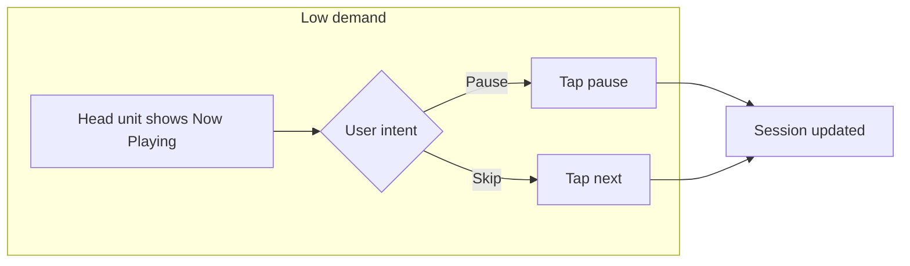
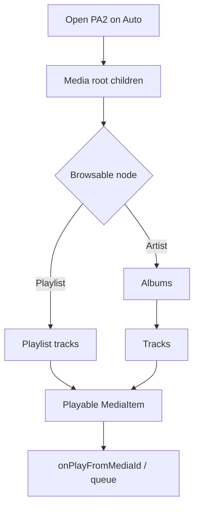

# Task analysis and flows — driver-critical music tasks

**Scope:** Music playback and library access for a **MediaBrowserService**-style app (Power Ampache 2) on **Android Auto**. Methods align with [android-auto-ux-research-plan.md](../android-auto-ux-research-plan.md) §5.

## Top driver-critical tasks (priority order)

| ID | Task | Goal | Typical trigger |
|----|------|------|-----------------|
| T1 | **Resume / pause** | Continue or stop playback safely | Screen tap, steering control, voice |
| T2 | **Skip next / previous** | Change track without browsing | Same |
| T3 | **Play something familiar** | Start music with minimal navigation | Voice (“Play …”) or shallow browse |
| T4 | **Pick from recents / continue** | Re-open last queue or recent album/playlist | Browse root → recents |
| T5 | **Search (voice-first)** | Find title/artist when browse is too deep | Voice preferred over typing while moving |

**Hypothesis (labelled):** T1–T3 cover >80% of “eyes on road” acceptable interactions for streaming users; T4–T5 need explicit guardrails ([05-design-guardrails-checklist.md](05-design-guardrails-checklist.md)).

---

## Hierarchical task analysis (abbreviated)

### T1 — Resume / pause

1. **Locate control** — Eyes: brief glance at now-playing; Hands: one action (or steering).
2. **Confirm state** — Cognitive: interpret play/pause icon (learned symbol).
3. **Act** — Manual: single tap / button.

**Demand:** Low visual, low manual, low cognitive when UI is stable.

### T3 — Play something familiar (browse + play)

1. Open app / media source (often voice or last-used).
2. Browse **1–3 levels** (e.g. Playlist → item, or Artist → Album → Track).
3. Select playable leaf.

**Demand:** Grows quickly with **depth** and **list length**; mitigation = voice, flat recents, continuation.

### T5 — Search while driving

1. Invoke search (voice or keyboard).
2. Disambiguate results.
3. Select and play.

**Demand:** **High** if keyboard + scrolling; **Medium–Low** if voice pipeline is reliable.

---

## Composite flow — “Resume then skip”

## Composite flow — “Browse library to play one track”

**Design implication:** Minimize **L1** choices at root for driving; surface **Continue listening**, **Playlists**, **Recent** before deep taxonomy (Ampache library is naturally deep).

---

## Mapping to Power Ampache 2 features

| PA2 capability | Task support | Notes |
|----------------|--------------|--------|
| Streaming + offline | T1–T4 | Offline badge clarity in browse (phone settings; host may not show badge — **open question**). |
| Multi-account | T3–T5 | Account switch is **high friction** on Auto; prefer **single active session** in car. |
| Smartlists / search | T3, T5 | Voice and shallow entry points reduce depth. |
| Queue editing | T2 adjacent | Reordering on Auto is typically limited; defer heavy queue edit to **phone**. |

---

## Eyes-busy / hands-busy tags

| Task | Eyes | Hands | Cognitive |
|------|------|-------|-----------|
| T1 | Low | Low | Low |
| T2 | Low | Low | Low |
| T3 | **High** if deep | Medium | Medium–High |
| T4 | Medium | Medium | Medium |
| T5 voice | Low–Med | Low | Medium |
| T5 typing | **High** | High | High |

---

## Ethical pattern scan (public sources only)

Document behaviours from **official help / design docs** for major music platforms on Auto; do **not** scrape proprietary apps or copy pixels. Update this section as public references are collected.

**Placeholder table**

| Pattern | Public reference type | Implication for PA2 |
|---------|----------------------|---------------------|
| Voice-first artist/album play | Platform voice docs | Align `MediaSession` voice actions |
| Shallow “Recents” | Design-for-cars media type | Mirror in browse tree root |

See [03-music-auto-ux-pattern-table.md](03-music-auto-ux-pattern-table.md) for the expanded pattern matrix.
